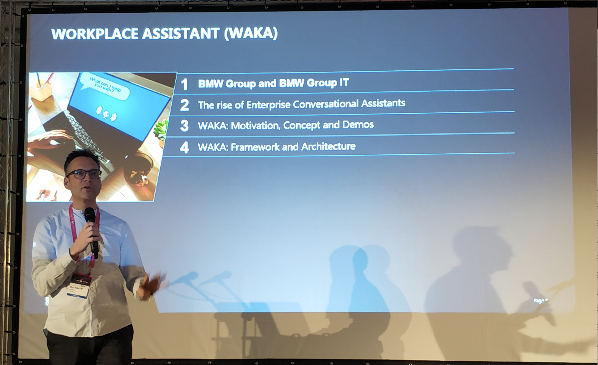
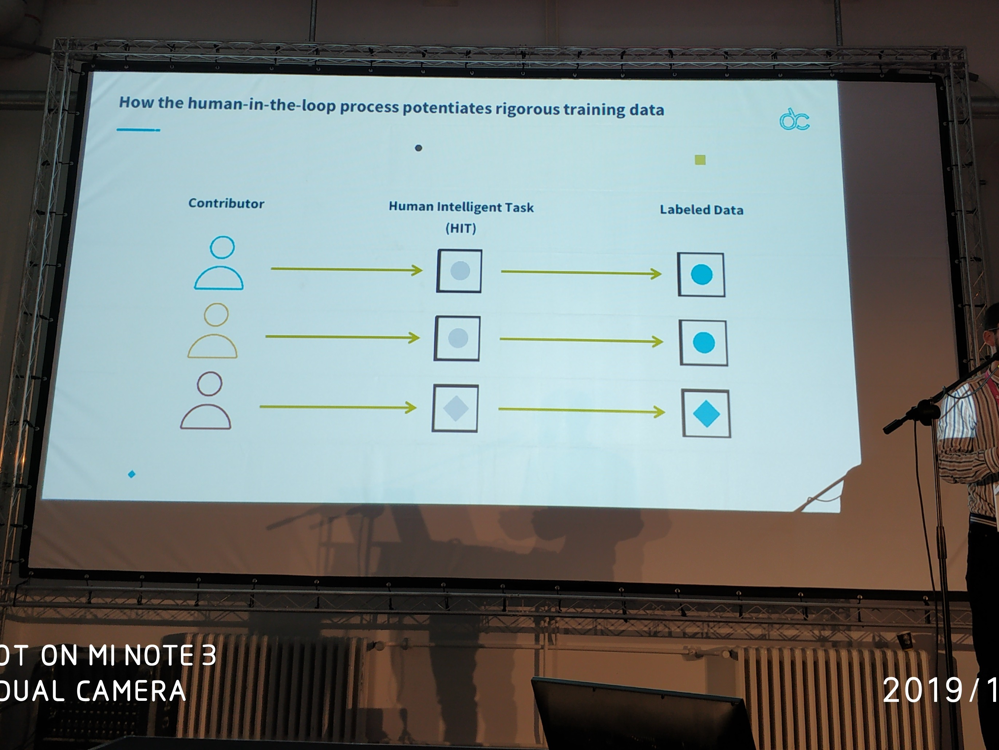
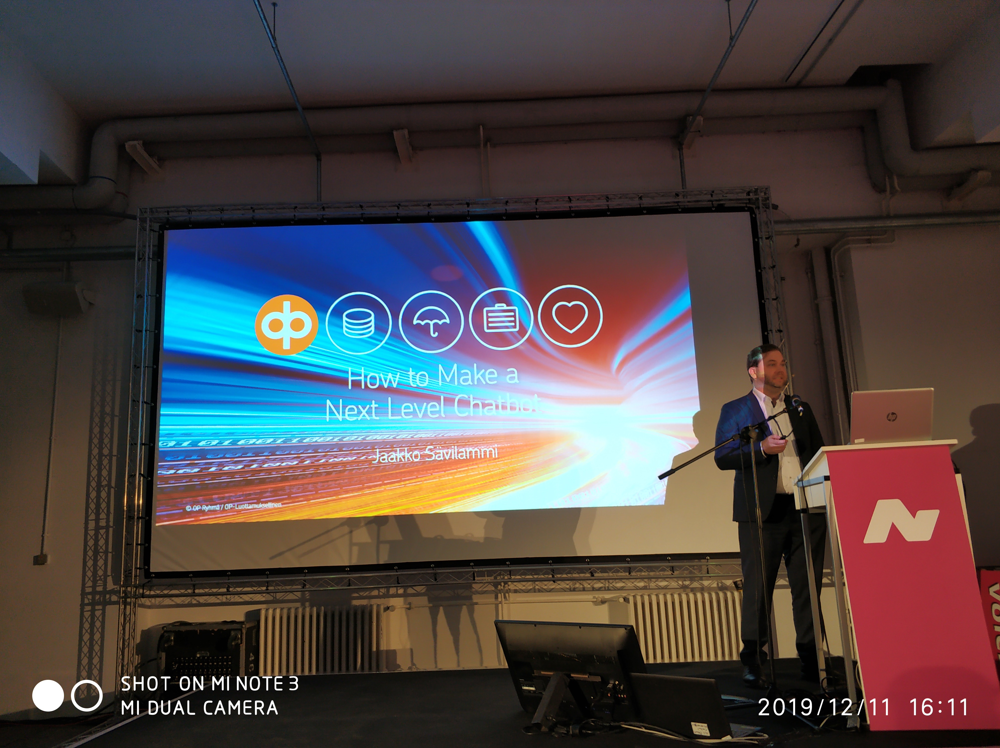
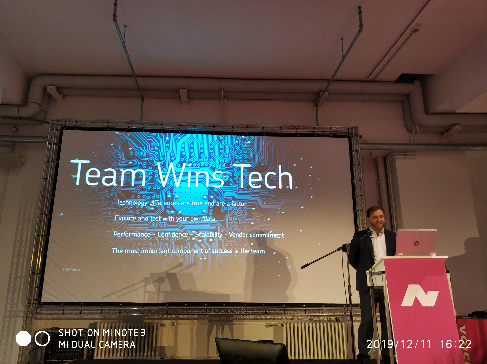

# Tech & A.I.

## Workplace Assistant - Towards a Virtual Employee Assistant at the BMW Group

Bernhard Pflugfelder, BMW

With the impressive advance of Artificial Intelligence (AI) and Natural Language Processing (NLP) in recent years, the historic vision of AI of reaching a natural and indistinguishable interaction between humans and machines comes significantly closer. Conversational assistants have become powerful business applications that make natural and personalized digital experiences reality. Thus, the BMW Group considers conversational assistants a strategic need for products and services throughout the company. In this talk, we want to introduce the first step on our journey towards realizing a company-wide conversational assistant for BMW Group employees called Workplace Assistant. Depending on their field of work BMW Group employees might face numerous repetitive activities during their business day. Examples are tasks such as managing calendars, booking meeting rooms, finding people with specific roles and skills and searching information for a specific topic or process. All of those daily activities are mainly not value-adding but time-consuming tasks. The Workplace Assistant targets those tasks in terms of realizing different skills (i.e. child bots) through only one multi-modal and interactive channel – Microsoft Teams. As a result, our users (BMW Group employees) have one single channel and user experience to manage meeting, book meeting rooms, search for people, and much more in the future.

## A Technical Perspective On How the Biggest Brands Build Their Chatbot Without Writing One Line of Code

Alexander Wijninga, Watermelon

Conversational is now. Mass-communication is shifting to personal one-on-one conversations, gathering information in the most human-like way. We already see so many ways in how businesses are implementing conversations into their strategy. New technologies make it possible for any business to add conversational to their website. In this talk, we will discuss the different technologies and how this will manifest further in the near future.

## Blending AI & the Human Touch

Tom Schollmeyer, Callcorp

As more customer service interactions shift from customer service representatives to chatbots, companies are carefully monitoring changes in customer satisfaction.

AI in the contact centre is not just a new gadget, but is the future of the industry. Are customers ready for AI-only customer service interactions? Tom discusses how AI is advancing at incredible speeds by learning rather than training and how this will bring down the costs while enriching the customer experience.

## Why You Don’t Need AI to Build a Good Chatbot

Anna-Katharina Rausch, BIG PICTURE GmbH

Slogans to promote the importance of voice and natural language interaction are everywhere. Many ask themselves, how to keep up with the trend and build a useful, profitable, cool chatbot on their own. The confusion starts with the term chatbot itself, since this is mostly not quite, what we are building, when we are into task/marketing automation or virtual assistants. Most of the so called chatbots are nothing more than just conversational agents and they are not meant to be anything else either. To interact in a dialogue with them has nothing to do with real organic conversation. And users‘ expectations seldomly get met.
If we add “more AI inside” and “ML on top”, everything will get better – that‘s the promise. But in reality we‘re missing out on important efforts and simple strategies to turn a bot into a more intelligent product. Without these efforts and strategies, we can use as much AI as we want and won’t succeed. Why is it, that most of the first Turing test Winners came without any AI and strike us to perform better? They seem to be more empathetic and to understand more than most of the AI bots nowadays. What are we missing out on? Let’s have a look!

## Why Rigorous Training Data is the Key to Chatbot Success

Rui Correia, DefinedCrowd

Not so long ago, we would have been dazzled if a machine replied, "Hi," when we said its name. Nowadays, we get frustrated when we ask our 'personal assistants' to call mom, and they actually call Don.

As consumer expectations soar, the tech industry is working hard to keep up with the demand for a near perfect human-machine interaction. But despite all the advancements and the time and money invested, these interactions still leave us feeling frustrated. Why? Because the AI models behind them require highly specialized training data to work properly.

The best chatbots and personal assistants are powered by deep learning models that need vast amounts of data to be trained. However, it's currently estimated that 15-20% of data used is garbage and 80% of data scientists’ time is spent scrubbing and cleaning data. This means high-quality training data is often difficult to obtain, expensive and hard to scale to new markets and domains. 

This talk will discuss the challenges around collecting and annotating multi-language and multimodal datasets for conversational AI. We’ll also look at the importance of eliminating bias and how a human-in-the-loop process can help ensure a fluent and – as near as possible – flawless chatbot experience.

## Blurring the Boundaries Between Human and Machine: What Makes Chatbots Human(-like) and How Does This Affect User Interaction and Behavior?

Ulrich Gnewuch, Karlsruhe Institute of Technology

Since the beginning of the chatbot hype, there has been a lively discussion about how “human-like”
chatbots should be. To make the interaction more natural and enhance user experience (UX), many
chatbots are given a name, are represented by a human-looking avatar, or are endowed with a
personality in general. However, these human-like or anthropomorphic cues can lead to unrealistic
user expectations that often turn into frustration and annoyance when the chatbot fails. Therefore,

designers, developers, and organizations are often unsure about the “appropriate” level of human-
likeness of their chatbot and its potential effects on user interaction and behavior. To address this

challenge, this talk will present theoretical and practical insights from several years of research on the
anthropomorphic design of chatbots at the Karlsruhe Institute of Technology (KIT). First, the talk will
provide an overview of the many different human-like or anthropomorphic cues in the design of
chatbots. Second, the underlying psychological mechanisms that lead users to (subconsciously)
respond to these cues when interacting with a chatbot will be explained. Finally, key findings from
several lab and field studies with real chatbots on the impact of these cues on user interaction and
behavior will be presented. This talk will be interesting for everyone who wants to learn more about
the theoretical aspects of human-chatbot interaction or aims to convince users to engage with their
existing chatbot.

## How to Make a Next Level Chatbot: Key Learnings From OP Financial Group's Success

Jaakko Sävilammi, OP Financial Group

OP is the largest financial group in Finland that has automated chats since 2017. Chatbot releases include insurance and banking chatbots. Hear out Conversational AI Chapter Lead Jaakko Sävilammi on what is a next level chatbot and how to develop one. What are the key bot-ingredients for happier customers, higher automation and increased employee satisfaction.

## Behind the Scenes of Vodafone TOBi Conversational AI Platform

Leonid Mishkind, Vodafone Group

We have entered the world of digital first, a place where customers want to chat anywhere, anytime. Multinational organisations like Vodafone are having to start that digital transformation, from traditional telcos to tech businesses. The explosion of chatbots is a new way to automate and improve repetitive customer services tasks allowing the customer to self serve 24/7.

